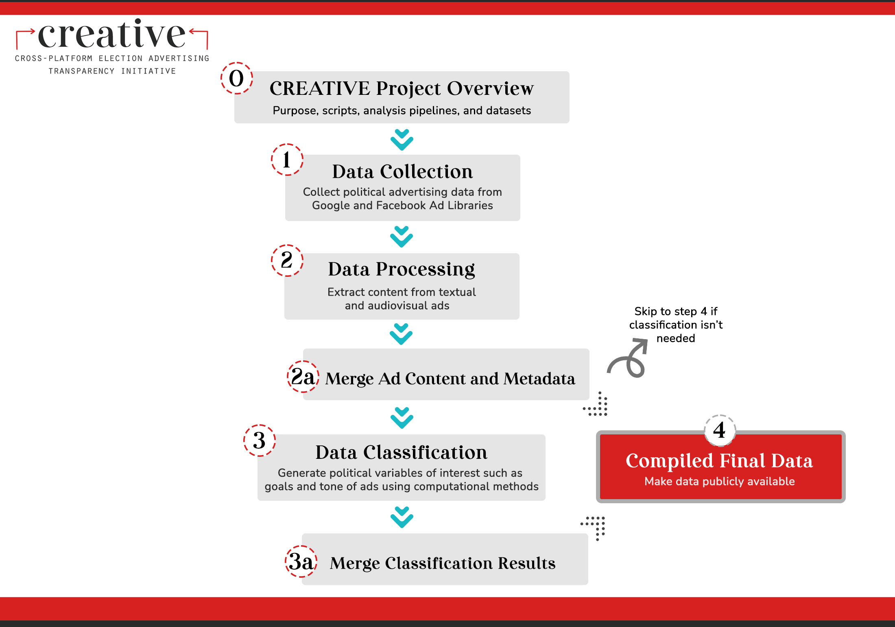
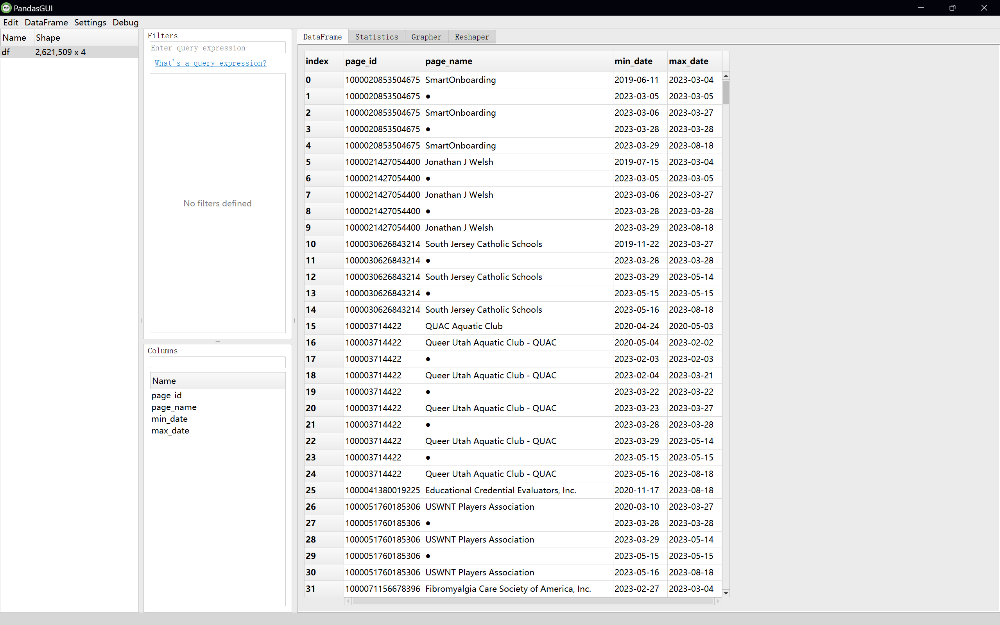

# CREATIVE --- fb_page_names

Welcome! This repository contains data and SQL scripts showing the history of changes in page names of Facebook advertisers.
The scripts provided here are intended to help journalists, academic researchers, and others interested in the democratic process to understand how Wesleyan Media Project track the continuity of advertisers' presence on Facebook.

This repo is part of the [Cross-platform Election Advertising Transparency Initiative (CREATIVE)](https://www.creativewmp.com/). CREATIVE is an academic research project that has the goal of providing the public with analysis tools for more transparency of political ads across online platforms. In particular, CREATIVE provides cross-platform integration and standardization of political ads collected from Google and Facebook. CREATIVE is a joint project of the [Wesleyan Media Project (WMP)](https://mediaproject.wesleyan.edu/) and the [privacy-tech-lab](https://privacytechlab.org/) at [Wesleyan University](https://www.wesleyan.edu).

To analyze the different dimensions of political ad transparency we have developed an analysis pipeline. The scripts in this repo are part of the Compiled Final Data in our pipeline.



## Table of Contents

- [1. Background](#1-background)
- [2. Data and Setup](#2-data-and-setup)
  - [Page Name Date Spans](#page-name-date-spans)
  - [Page Name History](#page-name-history)
- [3. Possible Data applications & Analysis](#3-possible-data-applications--analysis)
- [4. Thank You](#4-thank-you)

## 1. Background

As part of monitoring the electoral campaigns in the United States, Wesleyan Media Project downloads and stores the Facebook aggregate reports that are available from the [official Facebook page](https://www.facebook.com/ads/library/report). Within the all aggregate reports, the Lifelong ("All Dates") report is particularly important because it provides the total amount spent by a political advertiser on the platform. WMP stores these reports in a database and uses them to compute exact spend by advertisers within specific time periods, for instance, general campaign of 2022. You can read more about the aggregate reports and how they are processed in the [fb_agg_reports_import](https://github.com/Wesleyan-Media-Project/fb_agg_reports_import) repository.

When an organization or individual starts advertising on Facebook, they are assigned a unique "Page ID" and can choose a name for their "Facebook Page" (which represents their presence on the platform). However, advertisers can change the name of their Facebook Page at any time, and the Ads Library Report only shows the current name at the time the report was generated.

This can make it difficult to track how an advertiser's name may have changed over time since the report does not provide a history of previous names. Additionally, if a Facebook Page is taken down or encounters a temporary issue, the report may show an empty string (no name) instead of the actual name.

To address this issue, this repository provides two CSV tables `FB_page_name_history.csv` and `FB_page_name_date_spans` that contain information about previous names used by Facebook Pages between July 2019 (when Facebook started including Page IDs `page_id` in the report) and August 2023. One of these tables, `FB_page_name_date_spans` is provided as a zipped file `FB_page_names_date_spans.csv.zip`due to its large size.

By cross-referencing the information in these tables with the Ads Library Report, we can more accurately track how the names of political advertisers on Facebook may have changed over time, even if the current name in the report is different or missing.

## 2. Data and Setup

The csv files all rely on a SQL backend to create the table that is generated. The corresponding sql file for each data file is outlined below. As stated in the [fb_ad_imports repo](https://github.com/Wesleyan-Media-Project/fb_ads_import), the scripts will store data in an instance of MySQL (or MariaDB) that needs to be installed and running on your machine. In order to run the scripts, you will need to create the tables in a database in MySQL/MariaDB and enter some keyword values. We recommend you to run all the [Data Collection Pipeline repos](https://github.com/Wesleyan-Media-Project/creative_overview?tab=readme-ov-file#step-1-data-collection) first before running this repository to ensure you have the necessary data and tables set up in your database.

### Page Name Date Spans

The SQL script that was used to generate the data in `FB_page_name_date_spans` table is contained in the `fb_page_name_data_spans.sql` file.

To run this script, first, download the file `FB_page_name_date_spans.csv.zip` and unpack it. The resulting CSV file will be 143 MB large. Then, you can run the SQL script `fb_page_name_data_spans.sql` in your MySQL client. If you're using the command-line client, you can run the script by redirecting the contents of the `fb_page_name_date_spans.sql` file:

```bash
mysql -u your_username -p your_db < fb_page_name_date_spans.sql
```

Please make sure to replace `your_username` with your MySQL username, and you'll be prompted to enter your password. If you're using a GUI client like MySQL Workbench or phpMyAdmin, you can open the `fb_page_name_date_spans.sql` file and execute the SQL statements.

In this csv table, for each page id that had a change in its name, there is a row showing the page_id, page_name, and the date span when this name was in effect. The goal of this table is to assist analysts who have data for a past period but need to find out under what name did an advertiser operate at the time.

For example, here is a screenshot of the rows referring to Rep. Cori Bush [Wikipedia page](https://en.wikipedia.org/wiki/Cori_Bush) who in 2020 was elected to Congress as a representatives of the 1st Congressional District of Missouri.


### Page Name History

The SQL script that was used to generate the data in `FB_page_name_history.csv` is available in the `fb_page_name_history.sql` file. You can follow the same instructions for `fb_page_name_data_spans.sql` to execute this script.

The CSV file with this table is 9 MB large and did not require compression. The table contains page_id, last non-empty name of the page (last_known_as), and the previous names separated by the equals sign `=` as a delimiter (all_names).

Here is a screenshot of a few rows.


We anticipate that the `last_known_as` field will be especially useful. As was already mentioned above, when a page gets deleted, it is still reported in the aggregate report, but the page name field is empty. For somebody who is in possession of only a single CSV file with the aggregate report, it is impossible to find out (in an automated way) the names that were used by the page in the past.

## 3. Possible Data applications & Analysis

As an illustration of the utility of the data, let's examine if there were cases when pages have traded names: a name that was owned by one page_id would become associated with a different page_id.

The script takes the `FB_page_name_history.csv` file, splits the `all_names` string into individual page_names, joins the table with itself and keeps the rows where the page_ids were different. As a data cleanup step, the script excludes the entries where the page name was empty, or where it contained the words "Marketplace" or "Instagram".

As a final touch, the script chooses the rows where the names contained 'PAC' - an abbreviation for "Political Action Committee".

```{r}
library(dplyr)
library(readr)
library(tidyr)
library(stringi)

df = read_csv("FB_page_name_history.csv",
                         col_types = "ccc")

d = df %>% mutate(pn = stri_split(all_names, fixed="=")) %>%
  unnest(pn) %>%
  filter(pn != "") %>%
  filter(!stri_detect(all_names, regex="(?i)Marketplace|Instagram")) %>%
  select(-last_known_as)

x = d %>%
  inner_join(d,
             by="pn",
             suffix=c("_x", "_y"),
             relationship = "many-to-many") %>%
  filter(page_id_x != page_id_y) %>%
  distinct(pn, page_id_x, all_names_x, page_id_y, all_names_y)


x %>% filter(stri_detect(all_names_x, fixed="PAC")) %>% write_csv("pac_demo.csv")

```

And here is a screenshot of the `pac_demo.csv` opened in Excel:


### Interactive Data Analysis

The `csv` files produced in this repo are usually large and may contain millions of rows. In case you are interested in looking at the data in a more interactive way, we have provided two scripts, [readcsv.py](https://github.com/Wesleyan-Media-Project/fb_page_names/blob/main/readcsv.py) and [readcsvGUI](https://github.com/Wesleyan-Media-Project/fb_page_names/blob/main/readcsvGUI.py), in the root folder of this repo. If you want to analyze the data `FB_page_name_date_spans.csv.zip`, please make sure you unzip it first as these scripts only read `csv` files.

### Script `readcsvgz.py`

The script `readcsvgz.py` is a Python script that reads and filters the `csv.gz` files and saves the filtered data in an Excel file. It has the following features:

- Load a specified number of rows from a CSV file.
- Skip a specified number of initial rows to read the data.
- Filter rows based on the presence of a specified text (case-insensitive).

#### Usage

To run the script, you need to first install the required packages:

```bash
pip install pandas
```

After installing the required packages, you can run the script with the command line arguments.

For example, to run the script with the default arguments (start from row 0, read 10000 rows, no text filter), you can enter the following command in your terminal:

```bash
python3 readcsvgz.py --file FB_page_names_date_spans.csv
```

You can customize the behavior of the script by providing additional command-line arguments:

- `--file`: Path to the csv.gz file (required).
- `--skiprows`: Number of rows to skip at the start of the file (default: 0).
- `--nrows`: Number of rows to read from the file (default: Read 10000 rows in the data).
- `--filter_text`: Text to filter the rows (case-insensitive). If empty, no filtering is applied (default: No filter).

For example, to filter rows containing the text "Biden", starting from row 0 and reading 100000 rows:

```bash
python3 readcsvgz.py --file --file FB_page_names_date_spans.csv --nrows 100000 --filter_text Biden
```

To see a help message with the description of all available arguments, you can run the following command:

```bash
python3 readcsvgz.py --h
```

Please note that this script may take a while (>10 min) to run depending on the size of the data and the number of rows you requested. If you request the script to read more than 1048570 rows, the output would be saved in multiple Excel files due to the maximum number of rows Excel can handle.

### Script `readcsvGUI.py`

In addition to the `readcsvgz.py` script, we also provide a GUI version of the script that displays the data in a graphical user interface via [PandasGui](https://pypi.org/project/pandasgui/).

To run the `readcsvGUI.py` script, you need to first install the required packages:

```bash
pip install pandas pandasgui
```

If you are working on a non-Windows computer, you will need to go into the file `.../site-packages/pandasgui/constants.py` and change the line of code

```bash
SHORTCUT_PATH = os.path.join(os.getenv('APPDATA'), 'Microsoft/Windows/Start Menu/Programs/PandasGUI.lnk')
```

to instead be

```bash
if sys.platform == 'win32':
    SHORTCUT_PATH = os.path.join(os.getenv('APPDATA'), 'Microsoft/Windows/Start Menu/Programs/PandasGUI.lnk')
else:
    SHORTCUT_PATH = NonePY_INTERPRETTER_PATH = os.path.join(os.path.dirname(sys.executable), 'python.exe')
```

After installing the required packages and potentially changing the SHORTCUT_PATH, you can run the script with the following command:

```bash
python3 readcsvGUI.py --file FB_page_names_date_spans.csv
```

You can change the file to read by replacing the path `FB_page_names_date_spans.csv` to other file paths.

Here is an example of the GUI interface:

For more information on how to use the GUI interface, please refer to the [PandasGui documentation](https://pypi.org/project/pandasgui/).

## 4. Thank You

<p align="center"><strong>We would like to thank our supporters!</strong></p><br>

<p align="center">This material is based upon work supported by the National Science Foundation under Grant Numbers 2235006, 2235007, and 2235008.</p>

<p align="center" style="display: flex; justify-content: center; align-items: center;">
  <a href="https://www.nsf.gov/awardsearch/showAward?AWD_ID=2235006">
    
  </a>
</p>

<p align="center">The Cross-Platform Election Advertising Transparency Initiative (CREATIVE) is a joint infrastructure project of the Wesleyan Media Project and privacy-tech-lab at Wesleyan University in Connecticut.

<p align="center" style="display: flex; justify-content: center; align-items: center;">
  <a href="https://www.creativewmp.com/">
    
  </a>
</p>

<p align="center" style="display: flex; justify-content: center; align-items: center;">
  <a href="https://mediaproject.wesleyan.edu/">
    
  </a>
</p>

<p align="center" style="display: flex; justify-content: center; align-items: center;">
  <a href="https://privacytechlab.org/" style="margin-right: 20px;">
    
  </a>
</p>
